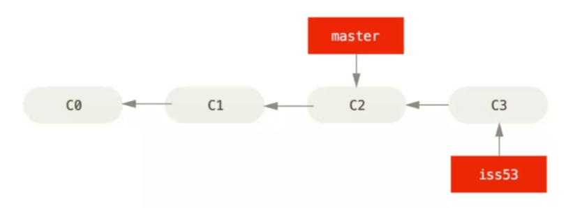

# Versioning


## Définition et Objectifs du Versioning:

La gestion de versions consiste à garder une trace de chaque modification apportée au code dans un type de base de données. Pour chaque modification, le système de contrôle de versions enregistre qui a fait le
changement, pourquoi il a été fait, et les détails spécifiques de la modification. 

**Cela permet aux développeurs :**
- De revenir à des versions antérieures si une nouvelle version cause des problèmes.
- De comparer les changements au fil du temps.
- De déterminer qui a apporté une modification spécifique en cas de problème.
- De travailler en parallèle sur différentes fonctionnalités sans perturber le travail des autres.

## Importance du Versioning:
- Traçabilité : 

- Chaque changement est enregistré avec un identifiant unique, souvent accompagné d'un message descriptif, ce qui facilite la compréhension de l'historique du projet.
- Collaboration: Dans des équipes de développement, plusieurs personnes peuvent travailler sur le même code source en même temps. Le versioning aide à synchroniser le travail de tout le monde, à résoudre les conflits et à intégrer les contributions de manière contrôlée.
- Backup et Rétablissement : En cas de perte de données ou de bugs, il est possible de restaurer n'importe quelle version antérieure du projet.
- Branching et Merging : Les développeurs peuvent créer des branches pour travailler sur des
fonctionnalités ou des corrections séparément (branching), puis intégrer ces changements dans la ligne principale de développement (merging).

**Exemples de Nomenclature de Versioning:**

La nomenclature de versioning varie selon les organisations et les projets, mais il existe des conventions communes. Une des plus courantes est le versionnage sémantique, ou SemVer, qui utilise un format de type MAJEURE.MINEURE.CORRECTIF :
- **MAJEURE**: Indique une version qui fait des changements incompatibles avec les versions antérieures.
 - **MINEURE**: Indique l'ajout de nouvelles fonctionnalités de manière rétrocompatible.
- **CORRECTIF** : Corrige les bugs du code.

## Aperçu des Systemes de Versioning

Il existe de nombreux systèmes de contrôle de version, mais les deux principaux sont Git et Subversion (SVN).
Ils ont des approches différentes pour gérer les versions, et chacun a ses avantages et ses inconvénients.

Subversion (SVN) et Git sont deux des systèmes de gestion de versions les plus populaires dans le
développement de logiciels. Voici un aperçu des deux, en commençant par SVN :

**Subversion (SVN) :**

Histoire et Concept :

SVN, également connu sous le nom d'Apache Subversion, est un système de contrôle de version centralisé
créé en 2000. II a été conçu pour remplacer CVS (Concurrent Versions System), en corrigeant ses défauts tout
en conservant un modèle similaire.

**Modèle Centralisé :**

Dans SVN, il existe un référentiel central unique où toutes les versions des fichiers sont stockées. Les
développeurs vont “checkout" une copie de travail du dépôt, faire leurs modifications, et ensuite “commit"
leurs changements dans ce dépôt central. Ce modèle centralisé signifie que les utilisateurs doivent être
connectés au réseau pouf soumettre des modifications, et que la perte du serveur central sans sauvegarde
appropriée peut entraîner la perte de l'historique du projet.

**Opérations et Fonctionnalités :**

+ Checkout/Update/Commit : Les opérations de base permettent de récupérer le code, de mettre à jour la
copie de travail et d'envoyer des modifications.

+ Branching et Merging : SVN gère les branches et les fusions, mais ces opérations sont souvent
considérées comme plus complexes et plus lourdes que dans Git.

+ Atomic Commits : Les commits dans SVN sont atomiques, signifiant que soit toutes les modifications
d'un commit sont appliquées, soit aucune, ce qui garantit l'intégrité du dépôt.

**Git :**

**Modèle distribué :**

Contrairement à SVN GIT fonctionne sur un modèle distribué, ce qui veux dire qu'il n'y a pas de serveur centrale.

**Opérations et Fonctionnalités :**

+ Branching et Merging : Les opérations de branchement et de fusion sont plus simples et plus rapides 
grâce à la nature distribuée de Git.

+ Staging Area : Git introduit la notion de "staging area” ou "index", qui permet de préparer et de réviser les
modifications avant de les commettre.

+ Flexibilité : Git supporte de nombreux workflows, tels que Git Flow et Forking, qui sont bien adaptés à
divers styles de développement.

**Performance :**
Git est conçu pour être très performant, avec des opérations rapides sur l'historique des versions et sur les
branches, même dans les grands projets.

**Réseau et Collaboration :**

La nature distribuée de Git le rend idéal pour les modèles de collaboration modernes, en particulier avec
l'émergence de plateformes telles que GifHub, GitLab et Bitbucket qui facilitent la revue de code, les pull
requests et l'intégration continue/le déploiement continu (CI/CD).

**Conclusion :**

SVN peut toujours être le choix préféré pour certains projets, en particulier ceux qui nécessitent un contrôle
d'accès fin et où le modèle centralisé est une approche adaptée. Cependant, Git est devenu le système de
gestion de versions standard pour la plupart des développeurs, en raison de sa flexibilité, de sa performance
et de son support pour les workflows distribués et collaboratifs.


### Git en détails

La différence entre GIT et les autres SCMs réside dans la façon don il considère les données.

#### Avec Git la quasi-totalité des oppérations sont locales.

#### Git se charge de gérer l'intégrité des données.

Avant la plupart des opérations effectués avec Git. Git effectue une "somme de controle", et obtient une signature unique qui sert de reference. On peut ainsi verifier l'intégrité des données. Cela signifie qu'il est impossible de modifier le contenu d'un fichier sans que Git ne le sache.

Le mécanisme utilisé par Git est appelé une empreinte SHA-1. Une chaine de caractère composées de 40 carractères hexadécimaux qui ressemble à ça :

````sh
26ac8b457692a4581c5487524a5545cb455236c5
````

#### Git a trois états principaux dans lesquels peuvent se trouver leurs fichiers :g


qui sont : 

- Modifié  :Modification d'un fichier

- Indexé : sauvegarde d'un fichier

- Validé : l'emplacement est validé

#### La première utilisation de Git

Git possède un outil appelé Git config qui permet de configurer les paramètres de Git sur votre système. Ces paramètres peuvent être stockés dans trois endroits différents :

- chemin/etc/gitconfig : Contient les valeurs appliquées a tous les utilisateurs et tous les projets. Si vous passez l'option --system a git config. il lit et écrit dans ce fichier spécifique 
- Fichier ~/.gitconfig : Spécifique a votre utilisateur. Vous pouvez forcer Git a lire et écrire dans ce fichier en passant l'option --global.
-Fichier config dans le répertoire Git d'un debot en cours d'utilisation (C'est à dire .git/config) : Spécifique au seul depot. Chaque niveau surcharges les valeurs du niveau précédent, donc les valeurs dans .git/config écrasent celles de etc/gitconfig.

Sur les OS Windows, Git recherche le fichier .gitconfig

Pour en savoir plus entrez la commande suivante : 

````sh
git config --list --show-origin
````

#### Configurer votre identidé

La première chose que vous devriez faire lorsque vous installez Git est de définir votre nom d'utilisateur et votre adresse e-mail. Ceci dans un soucis de tracabilité

````sh
git config --global user.name "maxime girardet"

git config --global user.email mon@email.com
````
#### Votre éditeur de texte :

**Vim**

- I : mode édition 
- échap : quitter le mode édittion

- ":" : entrer une commande (en dehors du mode édition)

Commande : 

- w = écrire /sauvegarder

- q = quitter

- q! = forcer quitter

Sur windows vous êtes obligé de spécifier le chemin complet de l'éditeur de texte.

Voici un exemple 

````sh
git config --global core.editor "'C:/Program Files/Notepad++/notepad.ewe'
-multiInst -notabbar -nosession -noPlugin"
````

#### Verifier vos paramètres

````sh
git config --list

git config user.name
````

### Les bases de Git 

#### Création d'un dépot.

Pour creer un depot Git, placez vous au sein d'un repertoire et entrez la commande :

```sh
git init
```

Cette commande va initialiser un depot Git, Git va traquer les toutes les modifications effectuées au sein de ce dossier.

Pour consulter l'etat du depot Git il suffit de lancer la commande :

```bash
git status
```

Pour ajouter des fichiers non suivis :

```bash
git add .
```

Pour sauvegarder votre travail :

```bash
git commit -m "votre message de commit"
```


Cette commande permet de créer notre branche distante et de push les données dessus :

```bash
git push -u origin main
```


Lier son dépot distant avec le dépot local :

```bash
git remote add origin "lien vers depot"
```

premier push :
```bash
git push -u origin main
```

autre push :
```bash
git push 
```

Pour cloner un dépot :

```bash
git clone https://github.com/bendahmanem/ISITECH-2324-B2-DEV-Versioning
```

#### Ignorer des fichiers

Pour ignorer des fichiers il suffit de creer un fichier gitignore et d'y ajouter les fichiers et les dossiers a ignorer

Git ignore automatiquement les dossiers vide !

#### Consulter l'état des ficiers
```sh
git status
```
```sh
git diff
```

Git status présente l'état global du dépot, modifié ou non, et git diff présente les modifications apportées aux fichiers.

On peut utiliser git diff de façon plus précise :
```sh
git diff --staged
```
#### Valider des modifications 

```sh 
git commit -m "message"
```

#### Effacer des fichiers 
Pour éliminer un fichier il faut utiliser les commandes suivantes :

```sh
rm <fichier>

git status

git rm <fichier>
```
Cette dernière commande va indexer le fichier pour qu'il soit supprimé lors du prochain commit.

Il existe une autre forme de suppression de fichier qui consiste à utiliser la commande suivante :

```sh 
guit rm --cached <fichier>
```
Cette commande va supprimer le fichier de l'index mais pas du disque dur.

#### Visualiser l'historique 

```sh 
git log
```

La commande log est très puissante et possède de nombreuses options. En voici quelques-unes :

```sh 
git log --stat
```
Cette commande affiche des statistiques sur les fichiers modifiés a chaque commit.

#### Désindexer des éléments déjà commits

A faire

```sh
git remote show origin
```
Cette commande permet d'inspecter les informations d'un dépot distant.

#### La création de tags (ou étiquettes)

En plus d'identifier les commits par des identifiants uniques, git vous permet aussi d'etiqueter un certain état de l'historique (commit)comme étant important. Cela peut etre utile pour marquer des versions majeures de votre code source. 

Par exemple :

```sh
git tag -a v1.0 -m "Version 1.0"
```

On peut donc lister ces tags avec la commande suivante :
 ```sh 
 git tag
```

#### Les branches

Lorsque vous faites un commit, Git enregistre un objet de commit qui contient un pointeur vers l'arbre de contenu qui représente l'état de votre projet à ce moment-la. ce pointeur de commit contient le nom SHA-1 du commit.


Pour creer une branche il suffit d'utiliser la commande suivante : 

```sh
git branch <nom de branche>
```


Git branch crée une nouvelle branche sans nous basculer dessus.

Pour basculer vers une autre branche, on utilise la commande 

```sh
git checkout <nom de branche>
```
Pour créer une branche et basculer directement dessus on utilise la commande suivante :

```sh
git checkout -b <nom de branche>
```

#### Fusionner des branches 


On va commencer à travailler sur l'issue 53 :

```sh
git checkout -b iss53
```


On va effectuer un premier commit

```sh
git commit -m "commit 3"
```


On va ensuite basculer sur la branche master afin d'effectuer un hotfix 

```sh
git checkout master
```


```sh
git branch hotfix
git commit -m "commit 4"
```

Nous sommes satisfait du hotfix et nous allons le valider :

```sh
git checkout master
git merge hotfix
```
La branche hotfix n'a plus d'utilité, allons la supprimer :

```sh
git branch -d hotfix
```

On va maintenant retourner sur iss53 et continuer à travailler

```sh
git checkout iss53
```

```sh
git commit -m "commit 5"
```


```sh
git checkout master 
git merge iss53
```
La stratégie de merge est alors différente de celle utilisée précedemment : Merge commit


Au lieu d'avancer la branche master, Git cree un nouveau commit qui contient les différences entre les deux branches.


### Resoudre des conflits

Un conflit a lieu lorsque deux branches differentes ont modifiées la meme partie du meme fichier, ou si un fichier a été supprimé dans une branche alors qu'il a été modifié dans une autre.


Physiquement, un conflit est représenté par des caractères spéciaux qui apparaissent dans le fichier.


Pour résoudre un conflit il suffit de choisir une des deux modifications ou alors faire un mélange des deux 

Après résolution du conflit il suffit de commit.

Vous avez un outil qui permet de résoudre les conflits avec git :

```sh
git mergetool 
```

